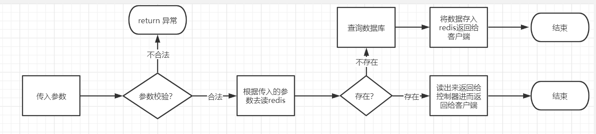
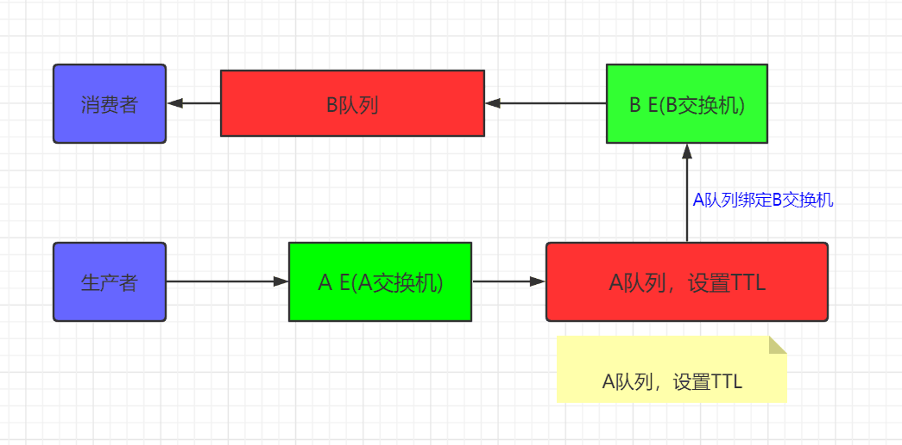
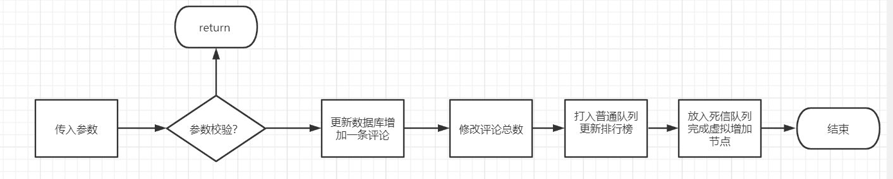
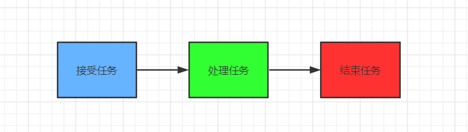
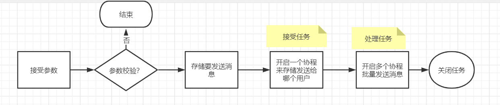
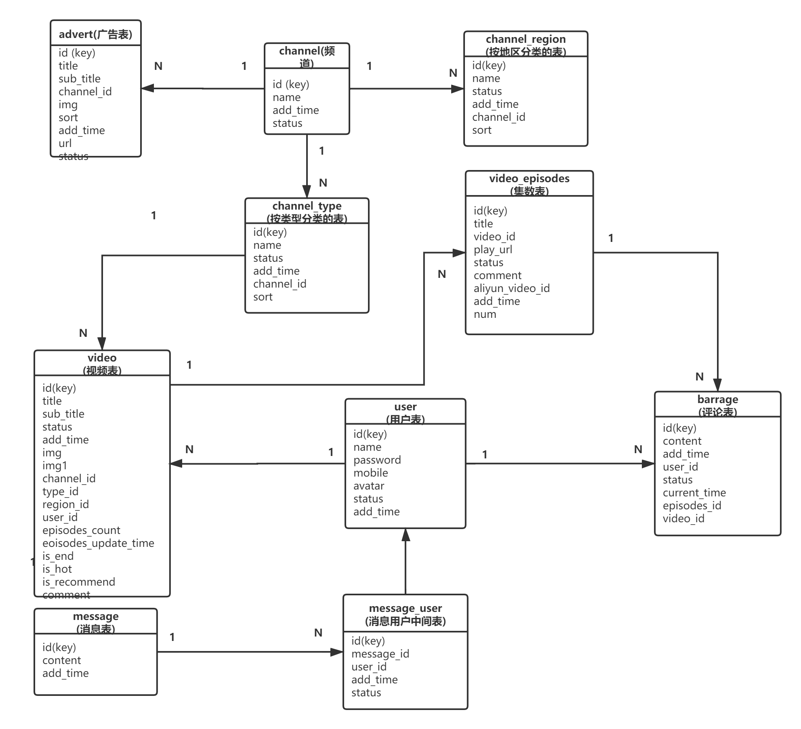

#### 前言

&emsp;&emsp;这个是对一个用PHP开发的视频网站进行重构，主要完成了视频分类展示、排行榜、弹幕、评论以及热门推荐等功能。

#### 使用到的技术和重构思想

- 服务端：Beego+MySQL+Golang+RabbitMQ+Redis
- 前端：HTML+JS+Jquery+Ajax

##### 主要优化的地方

- **排行榜功能：**排行榜功能我这里使用的Redis 有序集合zset来进行优化 。

  实现思路：我这里以频道排行榜为例，其它排行榜都是同样的思路。

  

  上面展示的是大概的实现思路，具体用redis优化的还有评论列表和剧集列表接口，只不过是类型不同。

- **RabbitMQ优化发布评论后排行榜更新功能。**

  在业务场景上，因为评论和排行榜有关联，当用户发起评论时候会更新排行榜，这个是用户发表评论也会被影响。先使用普通队列来更新排行榜，然后再延迟增加评论数。这种模式就是死信队列如下图：

  

实现思路如下：

- **goroutine 批量发送消息功能**

  这次改造的是批量发送消息，当发送消息时我们使用协程的并发的方式批量发送消息，这也是golang的一大特点。

  我这里是模拟任务池的方式来处理批量发送功能。

  模拟线程池：

  

实现思路：

#### 数据表关联关系

